# 👋 Hi, I'm Akash Narayankar

### 💻 Java Full Stack Developer | M.Tech Computer Engineering

I’m a passionate developer focused on building practical, user-friendly and
real-world software applications.

Currently pursuing **M.Tech in Computer Engineering** and continuously
improving my skills in backend development, full-stack applications,
databases and modern web technologies.

---

## 👨‍💻 About Me

- 🎓 Pursuing **M.Tech in Computer Engineering**
- 💻 Interested in **Java Full Stack Development**
- ☕ Strong interest in **Core Java, Spring Boot & React**
- 🌐 Building web applications using **React**
- 🗄️ Working with **MySQL, MongoDB & Firebase**
- 🚀 Interested in developing real-world software solutions
- 📚 Always learning new technologies and improving my development skills

---

## 🛠️ Tech Stack

### 💻 Programming Languages

### 🌐 Frontend

### ⚙️ Backend

### 🗄️ Database

### 🔧 Tools & Technologies

---

## 🚀 Featured Projects

### 📌 Smart Attendance Marking System

A smart attendance management system designed to simplify
attendance marking and management using modern web technologies.

**Technologies:** Java • Spring Boot • React • Firebase

🔗 [View Project](https://github.com/akash274545/Smart-Attendance-Marking-System-Deploy)

---

### 🤖 AI Chatbot

An AI-based chatbot application developed to provide an
interactive conversational experience.

**Technologies:** JavaScript • Web Technologies

🔗 [View Project](https://github.com/akash274545/AI-Chatbot)

---

### 🎓 Student Fee Management System

A student-focused application for managing student fee-related
information and records.

**Technologies:** JavaScript • Web Technologies

🔗 [View Project](https://github.com/akash274545/Student_Fee)

---

### 📱 Student QR Scanner

A QR-based application for scanning student information and
supporting attendance-related workflows.

**Technologies:** React • JavaScript • Firebase

🔗 [View Project](https://github.com/akash274545/student-qr-scan)

---

### 🍽️ Meal Tracker

A web application designed to track and manage daily meal-related
information.

**Technologies:** JavaScript • HTML • CSS

🔗 [View Project](https://github.com/akash274545/meal-tracker)

---

## 💼 Experience

### Pune Metro — Internship

**Intern | 2026**

Gaining practical exposure to a professional work environment
and developing technical and problem-solving skills through
hands-on experience.

---

## 🎓 Education

### M.Tech — Computer Engineering
**Bharti Vidyapeeth (Deemed to be University), Pune**

**2026 – Present**

### B.Tech — Information Technology
**Shivaji University, Kolhapur**

**2022 – 2026**

---

## 📜 Certifications

- ☕ **Advanced Java Programming Concepts and Techniques** — MKCL
- 🐙 **Git & GitHub Bootcamp** — LetsUpgrade
- 🗄️ **Introduction to Databases with SQL** — CS50, Harvard University
- 💻 **Alpha DSA with Java** — Apna College
- 🌐 **HTML Certification Test** — KnowledgeGate
- ☁️ **The Basics of Google Cloud Compute** — Google Cloud
- 🤖 **AI for Students: Build Your Own Generative AI Model** — NxtWave
- 🗣️ **Digital Body Language** — LinkedIn Learning

## 🏆 Achievements

- 🥇 **1st Rank** — Shivaji University Merit/Rank Order, 2023–24
- 🚀 **Top Performer** — GenAI Study Jam 2024, GDG Dr. J.J. Magdum College of Engineering.
- 💼 **Pune Metro Internship** — 2026
- 🛠️ Built and maintained multiple full-stack and web applications
- 🚀 Developed multiple real-world software projects
- 🎓 B.Tech in Information Technology

---

## 📊 GitHub Activity

  

  

---

## 🤝 Connect With Me

---

### 💡 "Build. Learn. Improve. Repeat."

⭐ Thanks for visiting my profile!
